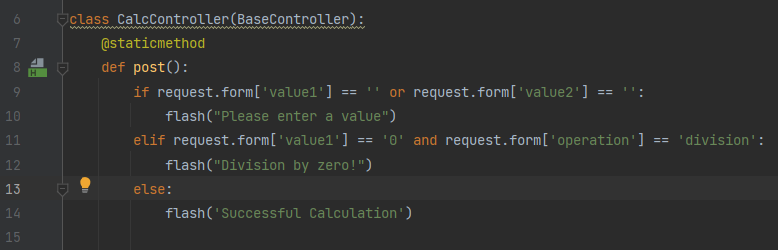
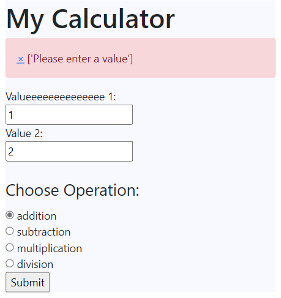
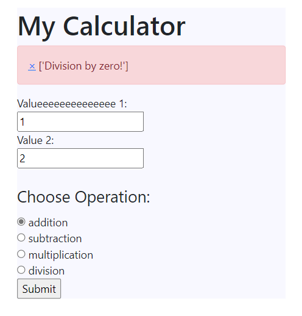

# Calculator Project Branch 5
## Added Branch with Improvements 

1. Run Pip Install
pip install -r requirements.txt

2. To run tests, Lint, and Coverage report use this command: pytest  --pylint --cov

# Pylint Coverage Screenshots:

# Flash Messaging Screenshots

